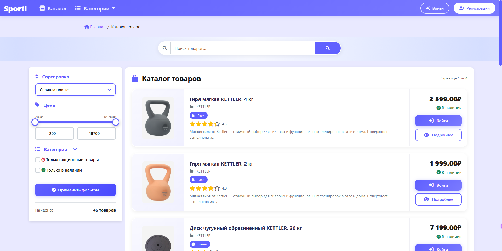
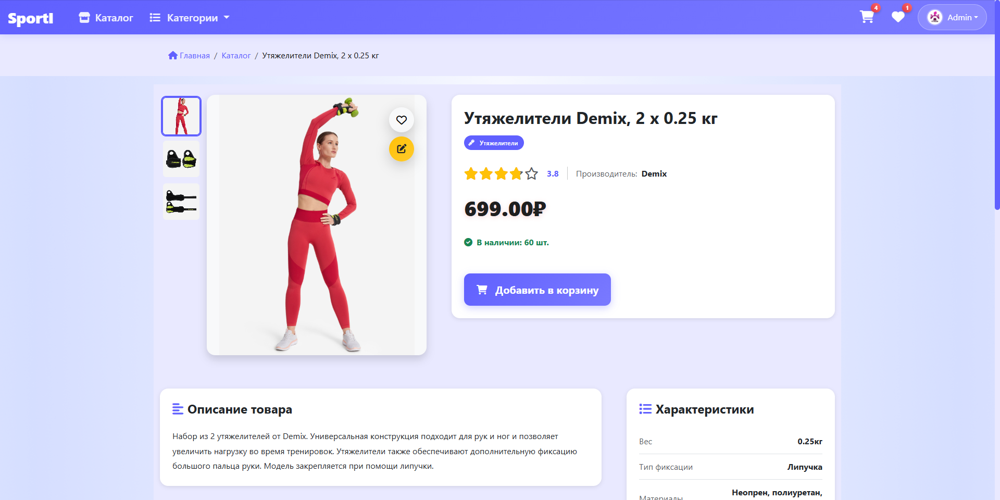
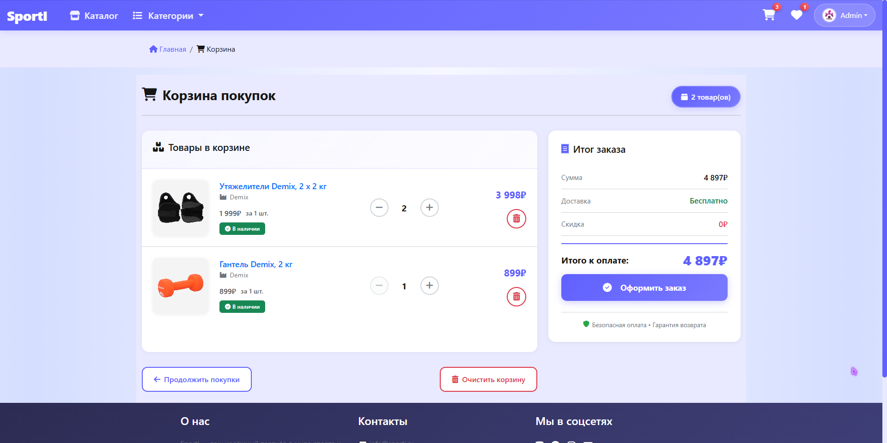
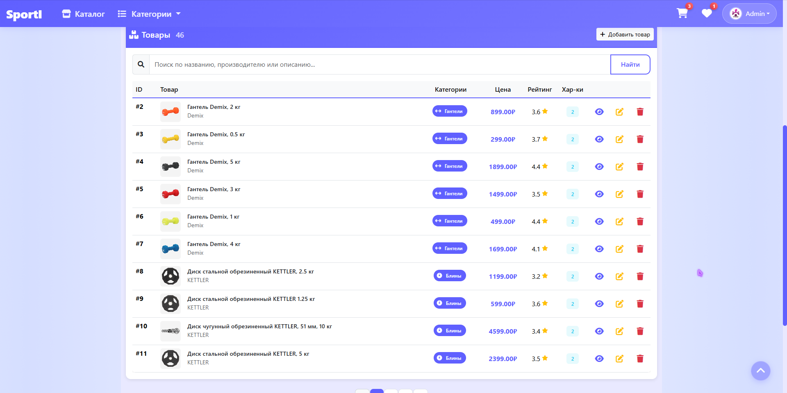

# 🏆 Интернет-магазин спортивных товаров

[](https://nodejs.org/)
[](https://expressjs.com/)
[](https://www.mysql.com/)
[](https://getbootstrap.com/)

## 📌 О проекте

Полнофункциональный интернет-магазин спортивных товаров с продуманной бизнес-логикой. Проект создан для демонстрации навыков веб-разработки и может быть адаптирован под реальные задачи бизнеса.

**Ключевая функциональность:**
- **Каталог и корзина**: фильтрация по категориям, система скидок (включая оптовые), динамическое обновление цен.
- **Управление скидками**: фоновое `cron`-задание автоматически обновляет статус акций (включает/отключает скидки по расписанию).
- **Пользователи и заказы**: регистрация, личный кабинет, полная история заказов.
- **Эмуляция платежного шлюза**: демонстрация полного цикла оплаты без реальных транзакций (легко заменяется на любой API: ЮKassa, Stripe).
- **Админ-панель**: полноценное CRUD-управление товарами, категориями, заказами и пользователями.

## 🛠 Технологический стек

**Backend:**
- **Node.js** — среда выполнения
- **Express.js** — веб-фреймворк
- **MySQL** — реляционная база данных
- **express-session** — управление сессиями
- **bcrypt** — хеширование паролей

**Frontend:**
- **EJS** — шаблонизатор (серверный рендеринг)
- **Bootstrap 5** — адаптивный интерфейс
- **CSS** — кастомные стили

## 📸 Скриншоты интерфейса

| Каталог товаров | Страница товара | Корзина |
|:---:|:---:|:---:|
|  |  |  |

## Админ-панель



## 🌐 Демо-версия

**Посмотреть работающий проект можно по ссылке:**  
👉 [http://93.171.100.89:5756/](http://93.171.100.89:5756/)

> **Важно:** Это тестовый сервер, который может быть недоступен в определенные часы. Если сайт не открывается — скорее всего, я тестирую обновления или настраиваю сервер. Загляните позже!

### 🧪 Тестовые данные для входа

Чтобы оценить все возможности, вы можете войти как:
*   **Администратор:**  
    Логин: `admin@mail.ru`  
    Пароль: `qwerty`
*   **Обычный пользователь:**  
    Логин: `user@mail.ru`  
    Пароль: `qwerty` (или зарегистрируйтесь сами)

---

## 🚀 Быстрый старт (для разработчиков)

Если вы хотите запустить проект локально, выполните следующие шаги:

### 1. Требования
- Node.js (версия 16.x или выше)
- MySQL (версия 8.x или выше)
- Git

### 2. Клонирование и установка
```bash
git clone https://github.com/DanilFiuzov/PetProject
cd PetProject
npm install

📄 Лицензия
MIT

📬 Контакты
GitHub: DanilFiuzov

Почта: van_dam_0@mail.ru